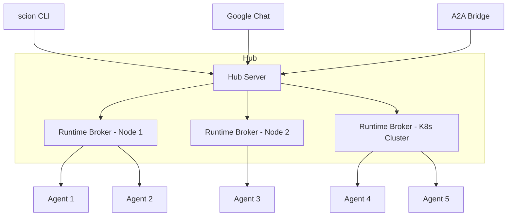
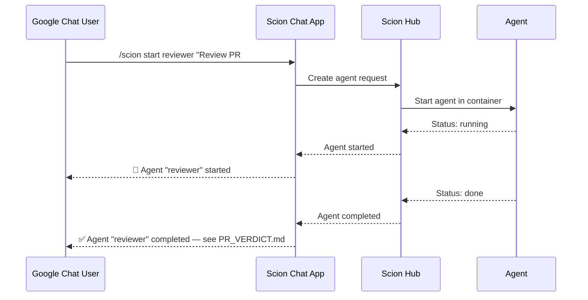

# Advanced Patterns — Hub & Ecosystem

!!! danger "Experimental Features"
    The topics on this page involve Scion features that are **alpha/experimental**. APIs, configurations, and behavior may change between versions. Use for exploration and prototyping, not production workloads.

---

## Hub Architecture

The **Hub** extends Scion from a single-machine tool to a centralized control plane for multi-machine agent orchestration.

### Local Mode vs Hub Mode

| Capability | Local Mode (Workshop) | Hub Mode (Advanced) |
|---|---|---|
| **Agent dispatch** | Local containers | Distributed across nodes |
| **State management** | `.scion/` directory | Centralized Hub server |
| **Scaling** | Limited by local resources | Horizontal via Runtime Brokers |
| **Access** | CLI only | CLI + API + Google Chat |

### Architecture



### Getting Started with Hub

```bash
# Start the Hub server
scion server

# Connect a Runtime Broker on another machine
scion broker --hub-url http://hub-server:8080
```

---

## ADK Agent Integration

Build a Python ADK (Agent Development Kit) agent that integrates with Scion's lifecycle management.

### Why ADK + Scion?

- **ADK** provides the agent framework (tools, callbacks, LLM routing)
- **Scion** provides the infrastructure (containers, isolation, orchestration)

Together: you build agent logic in Python, Scion handles deployment and coordination.

### The `sciontool` Interface

ADK agents communicate lifecycle state to Scion via `sciontool`:

```python
import subprocess
import json

def report_status(phase: str, activity: str, detail: str):
    """Report agent status to Scion lifecycle manager."""
    subprocess.run([
        "sciontool", "status",
        "--phase", phase,
        "--activity", activity,
        "--detail", detail
    ])
```

### Exercise

<div class="exercise-card" markdown>

#### :material-file-document: Exercise: Build an ADK Scion Agent

**File:** `exercises/prd_adk_agent.md`
**Duration:** 30 min
**Objective:** Create a Python ADK agent with `sciontool` lifecycle integration, package it in a template, deploy it alongside Gemini CLI agents.

</div>

---

## A2A Protocol Bridge

The **Agent-to-Agent (A2A) Protocol Bridge** exposes Scion agents as A2A endpoints, enabling external systems to interact with them via the standardized A2A protocol.

### Capabilities

- JSON-RPC interface for agent interaction
- Agent cards for capability discovery
- Webhook push notifications for async workflows
- Requires Hub mode

### Use Case

External systems (other agent frameworks, CI/CD pipelines, chat platforms) can discover and interact with Scion agents without knowing Scion's internal API.

---

## Google Chat Integration

The **scion-chat-app** bridges Google Chat and Scion Hub, enabling agent management directly from Chat.

### Features

- Slash commands: `/scion start`, `/scion list`, `/scion message`
- Bidirectional messaging: send commands, receive agent notifications
- Notification subscriptions: get alerts when agents complete or fail

### Architecture



---

## Custom Harness Development

The **AMP example** demonstrates how to build a custom harness for Scion without modifying Scion's Go source code.

### What's a Harness?

A harness is an adapter that connects a specific LLM tool to Scion's container lifecycle. Built-in harnesses include Gemini CLI, Claude Code, and OpenCode.

### Building Your Own

A custom harness needs:

1. `config.yaml` — declarative metadata (name, version, capabilities)
2. `provision.py` — container-side provisioning script (install dependencies, configure the LLM tool)
3. Container image — Dockerfile for the harness runtime

This enables community contributions: anyone can make their preferred AI coding tool work with Scion.

---

## Mixed-Agent Orchestration (Future Vision)

!!! info "Future Phase"
    This is not yet implemented but represents the natural evolution of Scion's harness-agnostic architecture.

The vision: run **Gemini CLI + Claude Code + ADK agents** in the same grove, each specialized for different tasks:

| Agent | Harness | Specialization |
|---|---|---|
| `architect` | Gemini CLI | Architecture design, system prompt engineering |
| `implementer` | Claude Code | High-throughput code generation |
| `tester` | ADK (Python) | Custom test framework integration |
| `reviewer` | Gemini CLI | Code review with Gemini's analysis capabilities |

Templates already support harness specification — the orchestrator pattern naturally extends to mixed-harness teams.
