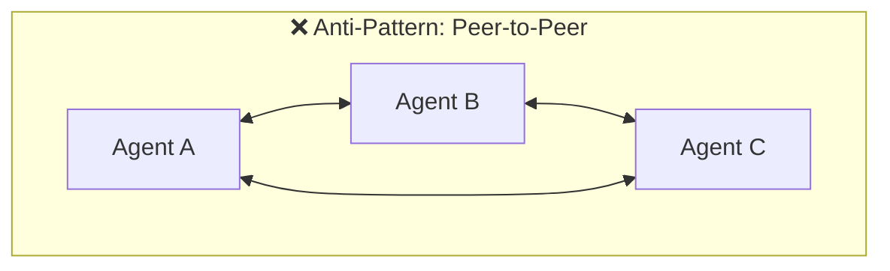
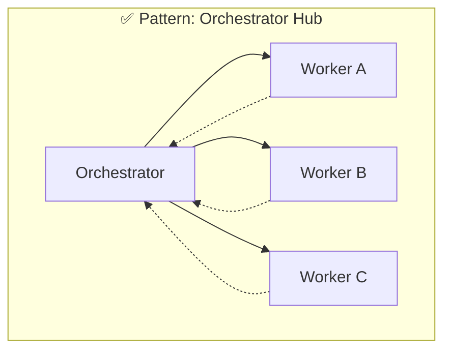

# Module 2: Agent Team Architecture <span class="duration-badge">60 min</span>

> **From user to architect.** Module 1 showed you what to build with agent fleets. This module teaches you how to *design* multi-agent systems — the patterns, communication models, and review mechanisms that make agent teams reliable.

---

## 2.1 — The Orchestrator Pattern <span class="duration-badge">10 min</span>

Every effective agent team has exactly one **orchestrator** — the lead agent that:

1. **Starts** worker agents with specific tasks
2. **Delegates** work to the right specialist
3. **Collects** results from workers
4. **Synthesizes** a final outcome

Workers never talk to each other directly. All coordination flows through the orchestrator.

### Anatomy of an Orchestrator Template

The orchestrator's `agents.md` defines the team:

```markdown
# Release Manager

## Available Roles
- **changelog-writer**: Generates release notes from git history
- **migration-checker**: Validates database migration compatibility
- **integration-tester**: Runs integration test suite and reports coverage

## Workflow
1. Start `changelog-writer` with the version tag
2. Start `migration-checker` and `integration-tester` in parallel
3. Wait for all three to complete
4. Review their outputs
5. Synthesize a release readiness report

## Completion Criteria
- All agents have completed successfully
- Release notes are generated
- No breaking migrations detected
- Integration test pass rate > 95%
```

!!! tip "The `agents.md` Is Your Architecture Document"
    Think of the orchestrator's `agents.md` as a **runbook for the team**. It defines roles, sequence, and success criteria. When someone new reads it, they understand the entire team design.

### Anti-Pattern: Peer-to-Peer Communication





Peer-to-peer creates chaos — agents duplicate work, contradict each other, or deadlock. The orchestrator pattern ensures **single source of truth** for task assignment and result collection.

---

## 2.2 — Communication Topology <span class="duration-badge">10 min</span>

Scion provides three communication patterns. Choose based on the coordination need:

### Direct Messaging

One-to-one communication between an orchestrator and a specific worker:

```bash
scion message reviewer-2 "Re-check the auth module — the fixer modified the JWT validation logic"
```

**Use when:** Assigning specific follow-up tasks, providing targeted feedback, or requesting re-work from one agent.

### Broadcast Messaging

One-to-all communication from the orchestrator to every agent in the grove:

```bash
scion message --broadcast "CODE FREEZE: All agents stop current work and commit progress immediately"
```

**Use when:** Coordination signals that affect the entire team — code freezes, priority changes, deadline alerts.

### Shared State Files

Multiple agents reading and writing to common files for structured data exchange:

```json
// review-findings.json — written by multiple reviewer agents
{
  "security": {
    "agent": "sec-reviewer",
    "status": "complete",
    "findings": [
      {"severity": "high", "issue": "XSS in product description rendering"}
    ]
  },
  "performance": {
    "agent": "perf-reviewer",
    "status": "in-progress",
    "findings": []
  }
}
```

**Use when:** Agents need to contribute structured data that other agents (or the orchestrator) will consume. More reliable than parsing natural language messages.

### Decision Matrix

| Need | Pattern | Example |
|---|---|---|
| Assign a task to one agent | Direct message | "Review the auth module" |
| Signal the entire team | Broadcast | "Code freeze" |
| Exchange structured data | Shared state file | `findings.json`, `migration-plan.md` |
| Sequential hand-off | Shared state file | Agent A writes → Agent B reads |

---

## 2.3 — Adversarial & Review Patterns <span class="duration-badge">10 min</span>

One of the most powerful multi-agent patterns: a dedicated agent whose job is to **challenge other agents' work**.

### The Principle: Trust But Verify

In Module 1.5 (Incident Response), the `reviewer` agent challenged the `fixer`:

- "Does this fix address the root cause or just the symptom?"
- "What's the blast radius if this fix introduces a regression?"

This isn't just code review — it's **agent output validation**. The reviewer is checking whether the *agent itself* produced correct, safe, and complete work.

### Where to Apply Adversarial Review

| Scenario | Adversarial Agent | What It Checks |
|---|---|---|
| Code generation | Security auditor | Vulnerabilities introduced by the coder |
| Migration | Test writer | Regressions introduced by the migrator |
| Infrastructure change | Compliance checker | Policy violations in Terraform/K8s manifests |
| Documentation | Technical reviewer | Accuracy of auto-generated docs |
| Incident remediation | Safety reviewer | Blast radius and rollback safety of proposed fix |

### Read-Only Adversarial Agents

For maximum safety, adversarial agents should be **read-only** — they can inspect code and produce findings, but they cannot modify the codebase. This is enforced through the template's `agents.md`:

```markdown
# Security Reviewer

## Constraints
- You are READ-ONLY. Do not modify any source files.
- Your job is to REVIEW and REPORT, never to FIX.
- Output all findings to SECURITY_REVIEW.md.
```

!!! warning "Don't Let the Fox Guard the Henhouse"
    An agent that both writes code AND reviews it will always approve its own work. Separate the **producer** from the **reviewer** — different agents, different templates, different system prompts.

---

## 2.4 — Capstone: Multi-Agent PR Review Board <span class="duration-badge">30 min</span>

> **Hands-on exercise.** Design and run a complete multi-agent PR review team against ProShop.

### Step 1: Design the Team (5 min)

You'll build four templates from scratch:

| Template | Role | Pattern |
|---|---|---|
| `review-lead/` | Orchestrator | Fans out PR to reviewers, synthesizes verdict |
| `security-reviewer/` | Worker (adversarial) | Checks for vulnerabilities, injection, auth issues |
| `performance-reviewer/` | Worker (adversarial) | Profiles hotspots, N+1 queries, memory leaks |
| `architecture-reviewer/` | Worker (adversarial) | Evaluates design, coupling, separation of concerns |

### Step 2: Build the Templates (10 min)

Create the review-lead orchestrator template:

=== "scion-agent.yaml"

    ```yaml
    name: review-lead
    description: "PR review orchestrator — coordinates a multi-agent review board"
    harness: gemini
    ```

=== "agents.md"

    ```markdown
    # PR Review Lead

    ## Available Roles
    - **security-reviewer**: Checks for security vulnerabilities
    - **performance-reviewer**: Profiles performance issues
    - **architecture-reviewer**: Evaluates architectural decisions

    ## Workflow
    1. Read the PR diff (all modified files)
    2. Start all three reviewers in parallel
    3. Wait for all reviewers to complete
    4. Read each reviewer's findings file
    5. Synthesize a unified review verdict: APPROVE, REQUEST_CHANGES, or BLOCK
    6. Write the verdict to PR_VERDICT.md

    ## Completion Criteria
    - All reviewers have submitted findings
    - Unified verdict is written to PR_VERDICT.md
    - Any HIGH severity finding results in BLOCK verdict
    ```

=== "system-prompt.md"

    ```markdown
    You are a senior engineering lead conducting a PR review. You coordinate
    a team of specialist reviewers and synthesize their findings into a
    clear, actionable verdict.

    Be thorough but fair. Not every finding warrants blocking a PR. Use
    severity levels (LOW, MEDIUM, HIGH, CRITICAL) to prioritize.
    ```

Then create each reviewer template following the same triad pattern. Reviewer templates should include the **read-only constraint** from Section 2.3.

### Step 3: Run the Review Board (10 min)

```bash
# Copy your templates to the grove
cp -r samples/templates/review-lead .scion/templates/
# (copy reviewer templates similarly)

# Start the review board
scion start review-lead "Review all recent changes to the ProShop codebase. Focus on the product rating feature." --type review-lead

# Watch the team assemble
scion list

# Attach to reviewers to watch them work
scion attach security-reviewer
scion attach performance-reviewer
```

### Step 4: Iterate (5 min)

Read the `PR_VERDICT.md`. Did the reviewers catch everything? Did they miss something obvious?

**Iterate on the system prompt:** "The security reviewer missed SSRF — how do we improve the system prompt to catch URL-based vulnerabilities?"

This iterative refinement of templates is *the* skill you take home. The templates are your reusable asset.

### Exercise File

<div class="exercise-card" markdown>

#### :material-file-document: Exercise: PR Review Board

**File:** `exercises/prd_review_board.md`
**Duration:** 30 min
**Objective:** Build 4 templates, run a multi-agent PR review, iterate on system prompts.
**Extension:** Adapt the review board for your own domain — incident response triage, release readiness check, architecture decision review.

</div>
